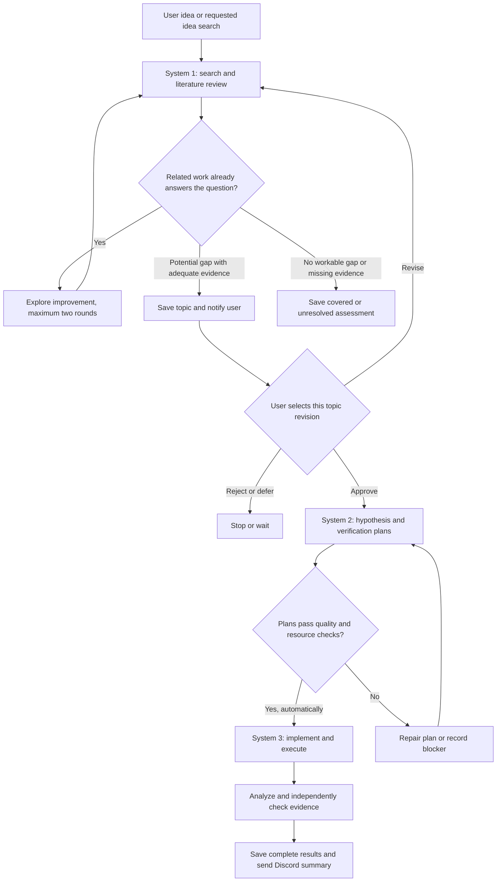

# Research automation implementation plan

Status: local implementation available. See [operating instructions](installation-guide.md) and [verification record](verification.md). Research inputs and generated artifacts live in ignored local workspace directories; literature review does not authorize topic selection or experiments.

## Goal and operating model

Build three cooperating systems that turn research ideas into traceable evidence and reproducible experiments. The user supplies ideas through the existing agent/chat interface, or explicitly asks the agent to discover ideas within a research area. System 1 automatically performs steps 1 and 2. It then stops until the user selects a topic. After approval, System 2 performs step 3 and automatically hands validated plans to System 3 for step 4.

| System | User steps | Responsibility | Specification |
| --- | --- | --- | --- |
| 1. Discovery and literature review | 1 -> 2 | Find related work, archive papers and notes, evaluate gaps, propose a topic | [Literature system](system/01-literature.md) |
| 2. Hypothesis planning | 3 | Turn an approved topic into falsifiable hypotheses and executable verification plans | [Hypothesis system](system/02-hypothesis.md) |
| 3. Experiment execution | 4 | Implement, run, verify, and report every hypothesis outcome | [Experiment system](system/03-experiments.md) |

All three use the [shared workflow and Discord contract](system/04-workflow-and-discord.md) and [artifact templates](system/05-artifacts.md).



Every meaningful action emits a durable event. Research actions also send a Traditional Chinese Discord embed: searches, paper processing, selectable topics, topic decisions, plan creation, experiment implementation, individual runs, verification, failures, and reports. General setup, system maintenance, and interface completion stay local. A selectable topic notification includes the question, closest work, bounded gap, limitations, and exact topic ID/revision. Notification delivery has its own retries and never bypasses topic approval.

Routine analysis starts/completions/reuse and file downloads/validation/saves remain
in the local audit only. Research conclusions and substantive evidence/workflow
blockers still notify; saved-file events are distinct from result summaries.
Validated single-paper analysis completion is an exception: send the substantive
study summary and PDF report. Requested research progress reports also attach PDF.

## User control

The mandatory interruption is between steps 2 and 3. Discovery may produce several topic candidates, but none may generate hypothesis plans or start experiments until the user approves it through this interface. Silence, a delivered Discord message, and an agent's recommendation never count as approval.

Approval identifies a topic ID and its content revision and authorizes planning and execution within recorded constraints. The user can approve, reject, defer, request further review, cancel a run, or narrow the scope. Discord provides outbound updates; the supplied webhook does not provide an inbound approval interface.

Suggested interaction after implementation:

```text
Investigate whether <idea> has already been studied.
Find research ideas about <area>, within <constraints>.
Approve topic <topic-id> revision <revision>, with <resource limits>.
Revise topic <topic-id>: <feedback>.
Reject topic <topic-id>.
Show status for <topic-id>.
Cancel run <run-id>.
Resume run <run-id>.
```

These intents are connected to the installed `research` CLI through [AGENTS.md](../AGENTS.md). Routine plan refinement and experiment execution proceed automatically after approval. A material change in the research question or resource envelope returns to topic selection.

## Required repository layout

```text
docs/
  plan.md
  system/*.md
ideas/<idea-id>.md
papers/<paper-id>.pdf
papers/<paper-id>.md
topic/<topic-id>.md
topic/<topic-id>-survey.md
hypothesis/<topic-id>-<hypothesis-id>.md
experiments/<topic-id>-<hypothesis-id>/
  README.md
  src/
  configs/
  tests/
  runs/<run-id>/
    manifest.json
    stdout.log
    stderr.log
    metrics.json
  analysis/
results/<topic-id>-<campaign-id>.md
results/<topic-id>-<campaign-id>/
  summary.json
  tables/
  figures/
state/
  research.sqlite3
```

Use `hypothesis/` for hypothesis plans. IDs use short, stable, filesystem-safe slugs with a collision suffix where necessary. Titles can change without renaming IDs. PDFs and notes share the same paper ID. Runtime directories are created when their first real artifact is produced.

## Evidence and verification rules

1. Every paper used as substantive evidence must have a verified, locally saved PDF and study note. Search snippets and abstracts support discovery only. Missing full text is an explicit evidence gap; it cannot silently become proof of novelty.
2. The literature survey compares the closest methods, assumptions, datasets, results, and limitations. Each material claim points to a study note and a precise location in its PDF.
3. Describe novelty as a bounded assessment: "No directly matching work found in the recorded search scope as of <date>." A finite search cannot establish that a topic has never been studied anywhere.
4. If the original idea is covered, investigate one improvement round and, if useful, a second. Each revised question receives its own comparison against related work. Stop after two rounds or the recorded search budget.
5. Freeze hypothesis criteria before confirmatory experiments. Require baselines, fair evaluation, uncertainty estimates appropriate to the design, mechanism checks, reproducibility, and preserved raw evidence.
6. Report all planned hypotheses, including negative, mixed, blocked, and inconclusive outcomes. A broken implementation or exhausted budget is not scientific disproof.

## Minimal implementation architecture

Start with one local Python package and one worker on the existing machine. Use the existing agent interface for research reasoning and user interaction. Use SQLite for transactional job state, approval records, checkpoints, and a Discord outbox; keep human-readable research artifacts in the requested directories. The experiment runner uses subprocesses with timeouts and resource limits. Pin project dependencies when implementation begins.

Build the shared coordinator and notifier once; each of the three systems owns its phase's decisions and artifacts. Keep search adapters narrow: begin with scholarly metadata search and original publisher/preprint sources, recording unavailable sources and current access requirements. Do not assume a particular model vendor, cloud service, Discord bot, multi-agent framework, or scheduler is required. The local worker must be explicitly started and remain running for unattended work; a chat response alone does not establish a background service.

Use `DISCORD_WEBHOOK_URL` from the runtime environment, the ignored workspace `.env`, then the external local secret store; the first nonempty value wins. The user's current configuration determines the destination. Never put its token in documentation, tracked configuration, manifests, experiment subprocess environments, or notification bodies. `.env.example` contains placeholders, and `.gitignore` excludes actual secrets and machine state.

No research topic, benchmark, or compute budget has been selected yet. Before a campaign, record usable hardware, datasets, maximum elapsed time, run count, disk use, agent/API cost, and any paid compute allowance. Default to local execution, one experiment at a time, zero paid compute, and bounded search and run limits. Unlimited values are invalid. Specific numeric limits are resolved from available hardware and recorded with topic approval.

## Implementation sequence and acceptance

| Milestone | Work | Acceptance evidence |
| --- | --- | --- |
| M1: shared runtime | Artifact validation, SQLite state transitions, approval ingestion, worker, event/outbox delivery, secrets handling | Restart keeps state; queued messages survive outages; unapproved topics cannot enter planning |
| M2: System 1 | Idea intake, searches, metadata verification, PDF archive, notes, survey, bounded refinement | One real idea reaches a documented decision with inspectable citations and a selection notification; covered/unavailable cases also terminate honestly |
| M3: System 2 | Approval-bound planning, hypothesis templates, resource checks, runnable specifications | An approved topic produces at least one feasible plan with frozen criteria; a stale approval is rejected; valid plans queue experiments automatically |
| M4: System 3 | Implementation, baseline reproduction, runs, analysis, verification, result report | One bounded campaign produces complete evidence and a Discord report, with success and negative/error paths demonstrated |
| M5: recovery proof | Interruption, cancellation, stale worker recovery, delivery replay | Resume preserves completed work; retries do not duplicate experiments; ambiguous notification delivery is visible |

Build a narrow end-to-end path first, then complete the failure and recovery paths. During development, use synthetic fixtures to exercise supported, unsupported, and inconclusive verdicts; clearly label fixtures and never present them as scientific findings. A real end-to-end campaign still waits for explicit topic approval.

## Focused validation before calling the implementation complete

- Submit an idea and verify step 2 runs automatically, then persists `AWAITING_SELECTION` across restarts.
- Attempt step 3 with missing, stale, rejected, or unrelated approval; each must fail without creating plans or running code.
- Verify every substantive citation resolves to a matching PDF, note, and evidence locator; HTML masquerading as a PDF and unavailable full text are caught.
- Exercise a covered idea through no more than two refinement rounds, preserving earlier assessments.
- Approve a topic and verify planning transitions into execution without a second routine approval prompt.
- Verify baselines and candidate use comparable data and budgets; a single favorable run cannot satisfy a repeatability requirement.
- Exercise all-negative and interrupted campaigns; both write accurate reports with every hypothesis accounted for.
- Test Discord success, timeout, rate limit, permanent failure, and restart replay; all events remain inspectable and secrets are redacted.
- Verify the final report links to run manifests, raw metrics, analysis, and the actual frozen plans.

## Scope and stop condition

The implementation provides the three systems, local worker, chat/CLI integration, evidence and experiment artifacts, durable decisions, and Traditional Chinese Discord embeds. It currently supports bounded local Python experiments with a single primary metric, paired baseline/ablation comparisons, bootstrap uncertainty, and independent process reproduction. Unsupported scientific designs produce a blocker rather than an artificial verification.

No real research topic has been selected. Integration fixtures verify application behavior and are not scientific findings. A real campaign remains subject to the human topic-selection gate.

The first implementation is complete when one selected topic can travel from idea intake through archived evidence, a persistent human selection gate, automatic planning and experiments, verified results, and confirmed Discord reporting, including the specified recovery and failure cases. A dashboard, Discord approval bot, distributed workers, scheduled idea discovery, and manuscript generation remain separate requests.
