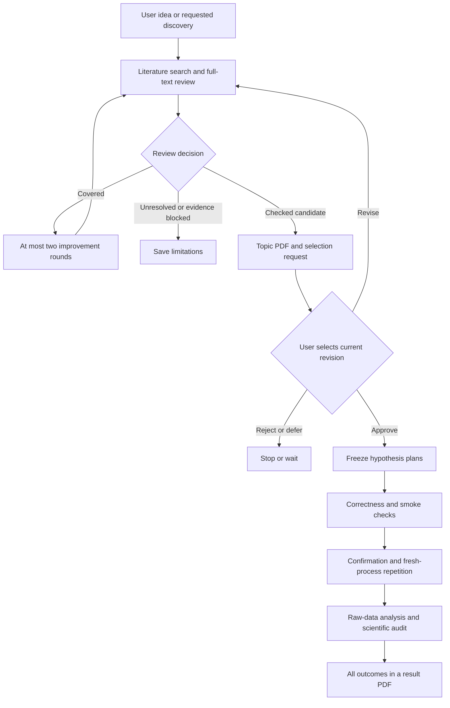

# Research automation system plan

Degree Savior connects a chat interface to a persistent local research worker.
This document specifies reusable behavior. Topic-specific questions, algorithms,
datasets, model sizes and experiments belong in ignored local artifacts.

## Three systems and the human gate

| System | User steps | Responsibility | Specification |
| --- | --- | --- | --- |
| Literature | 1 → 2 | Intake, discovery, full-text evidence, survey and bounded gap review | [System 1](system/01-literature.md) |
| Hypotheses | 3 | Approved question to frozen executable plans | [System 2](system/02-hypothesis.md) |
| Experiments | 4 | Measurements, verification and every result | [System 3](system/03-experiments.md) |

[Workflow and notifications](system/04-workflow-and-discord.md) and
[artifact contracts](system/05-artifacts.md) apply to all three.
Coding agents must also follow [diagnostic recovery](system/06-diagnostic-recovery.md)
after an `INVALID` or `INCONCLUSIVE` result: check every parameter against relevant
small experiments, fill missing evidence within authorization, and ask for user
help when an unresolved decision requires it. Preserve the original verdict and
freeze any follow-up before independent confirmation.

Steps 1–2 proceed automatically from a research request. The mandatory pause is
between steps 2 and 3. User approval identifies the exact topic revision, evidence
bundle, question and resource envelope. Steps 3–4 then proceed automatically.
Silence, a recommendation and Discord delivery are never approval.

## Implemented architecture

One Python package provides intake, scholarly adapters, planning, supervised
experiments and reports. SQLite holds generic records, jobs, events, artifacts
and a durable Discord outbox. One locked worker processes jobs; its sender thread
delivers queued messages independently. The Codex CLI supplies structured
reasoning using the local login; the project does not pin a reasoning model.

Files are atomically published and hashed, but filesystem and database writes
cannot form one transaction. Recovery reconciles pending publications, owned
processes, completed measurements and queued jobs before dispatching new work.
Completed valid runs are reused only when their frozen provenance matches.

Review uses OpenAlex, Crossref, arXiv and citation tracing. Source availability
can change. Official metadata establishes identity/publication; a readable,
matched local PDF and validated page claims establish full-text evidence.
The workspace can enforce a selected major-venue policy. Supplementary sources
remain visible without becoming hard evidence under that policy.

Planning freezes source, inputs, seeds, metrics, thresholds, allocation,
comparisons and verdict criteria before confirmation. The current runner supports
paired independent units, one primary metric, baseline and mechanism-ablation
comparisons, percentile-bootstrap intervals, Bonferroni adjustment and fresh
process repetition. Other designs must be explicitly implemented and validated;
the system must not pretend unsupported analyses were executed.

## Local artifacts and publication boundary

| Directory | Contents |
| --- | --- |
| `ideas/`, `topic/` | Original inputs, searches, surveys, revisions and decisions |
| `papers/` | Verified full texts, notes and paper-study PDFs |
| `hypothesis/`, `local/` | Topic-specific designs, reviewed proposals and frozen plans |
| `experiments/` | Campaign source, inputs, manifests, logs, metrics and analysis |
| `results/` | All hypothesis outcomes, PDFs, supporting tables and complete topic ZIPs |
| `state/` | SQLite, worker/agent records, checkpoints and receipts |

These directories, `.env`, the environment and `research.json` are ignored by Git.
The public repository contains generic source, tests, assets and shared docs.
Do not embed a local research question, study history, user path or credential
in those shared files. Relative links and generic placeholders describe contracts.

After a scientifically confirmed `SUPPORTED` or `NOT_SUPPORTED` topic conclusion,
create and verify `results/<topic>.zip` containing the topic's retained literature,
decisions, experiments, failed attempts, audits and reports. Follow the
[archive contract](system/05-artifacts.md#archive-after-a-confirmed-conclusion);
preserve the exact conclusion scope and keep credentials and unrelated records out.

## Resource and evidence rules

- Default to sequential local execution and no paid compute. Freeze finite
  per-run/campaign limits and record actual cost; matching one budget dimension
  does not establish equal total computation.
- Only the user selects topics or authorizes resource increases. An explicit time
  extension may update an unfinished campaign without changing scientific content.
- Search absence is bounded by sources and date, never proof of universal novelty.
  Preserve contradictory results, coverage limits and unavailable close work.
- Do not tune from confirmation, discard valid negative runs, or change criteria
  retrospectively. Record infrastructure retries separately from scientific results.
- Preserve all planned hypotheses, including invalid, blocked and cancelled work.
  A software test, completed subprocess or delivered report is not scientific support.

## Discord and operation

Use English embeds and PDFs for validated studies, syntheses, selection,
experimental conclusions, final results and substantive intervention requests.
Everything else stays in the local event log. Each selectable topic is delivered
separately as one PDF and one selection embed. Title/source/publication date lead
paper reports. The webhook is outbound only; selection occurs in the chat/CLI.

Credentials resolve from nonempty environment values, ignored workspace `.env`,
then the external secret store. Experiment subprocesses use a sanitized allowlist
and do not inherit webhook/API credentials. Notification failures do not alter
scientific outcomes or approval. Delivery has finite retries and possible
duplicates after ambiguous network failures.

The worker must actually run for unattended progress. Keeping the computer on,
connected and awake is required; this project does not install a startup scheduler.
See the [installation guide](installation-guide.md) for executable commands and
[verification](verification.md) for application checks.

## Acceptance and limits

Prove the full application path with labelled synthetic fixtures: review stops
at selection; stale approvals fail; frozen plans execute; raw-data reanalysis
matches; negative/incomplete reports are retained; crash recovery preserves work;
notification replay keeps receipts and does not expose credentials. Fixtures do
not establish research validity.

A dashboard, inbound Discord bot, distributed compute, automatic startup and
manuscript generation are outside the current implementation. Scientific
interpretation and any generalization beyond frozen experiments still require
domain review.
